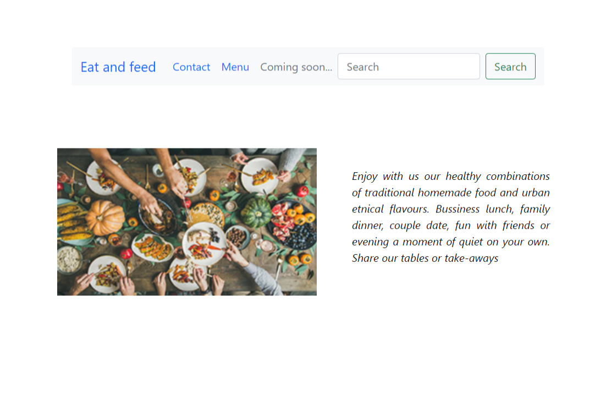
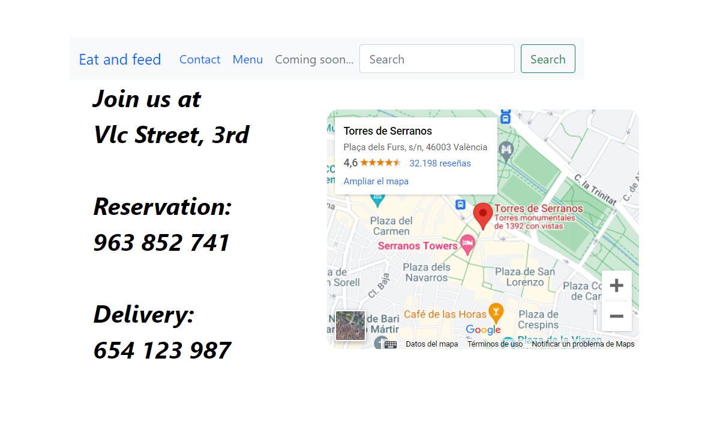
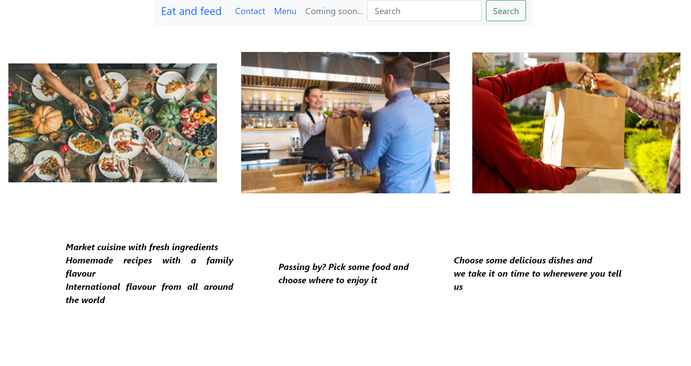

<h1 align="center">Restaurant</h1>

<h4 align="center">Restaurant Website Project<h4>

---

## About this project:

Project created for the Bootcamp - Full Stack Developer at GeeksHubs Academy: Create a restaurant website with HTML5, CSS3 and some Bootstrap elements. It must be responsive and include a minumum of 3 webpages (home, contact and menu).

## Screenshots  

  
  
  

## Requirements:

* Three pages: Home/Principal, Contact, Menu
* Must include Bootstrap
* Responsive

## Features:

* Responsive: The Nav Bar collapses to a scrolldown when resizing the web and the alined pictures nest into each other
* Uses Bootstrap.
* Uses HTML and CSS.
